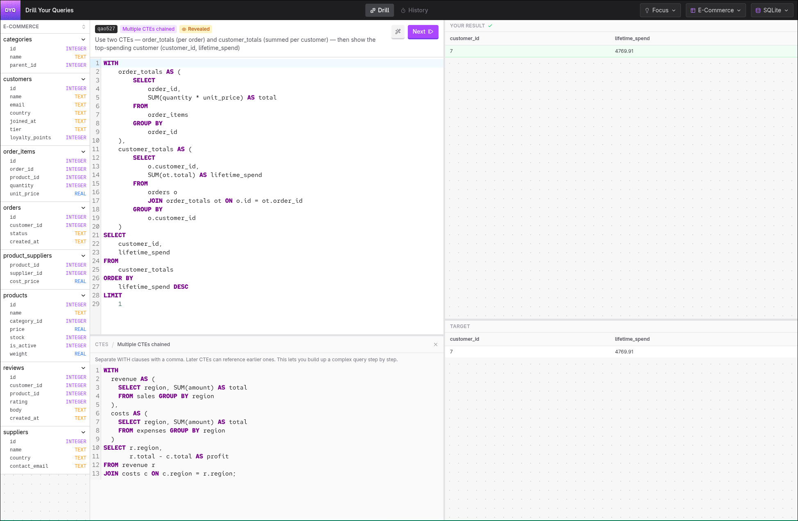

# Drill Your Queries

A website to help you get better at SQL. You're given a bunch of straightforward scenarios to test a specific concept or concepts. By writing similar variants of the same query you build familiarity and muscle memory. 

Scenarios are grouped by concept (selects, joins, CTEs etc.), engine (SQLite, PGLite, DuckDb), and schema (Ecommerce, HR etc.). 

Write your query to match the target output. Whilst there is a canonical answer, any SQL that produces the correct output will do!

Runs entirely in your browser via Cloudflare Pages. 

# Contributing

First of all, this is vibecoded. Which means, at this stage, there's no point submitting feature PRs. Create an issue for features and I'll yell at Claude for you. 

Second, I'm using this to learn SQL. Which means the scenarios are all generated by Claude because I don't know enough to write them myself. If you're interested in helping, feel free to look at the scenarios.   